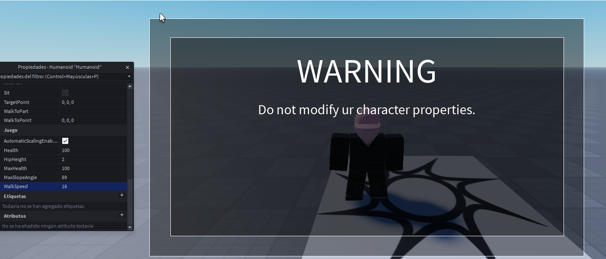
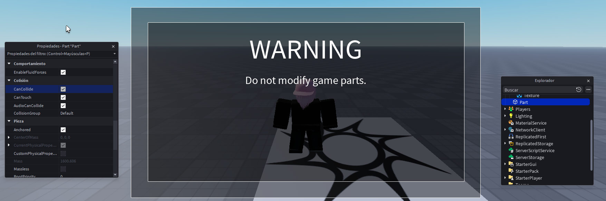

# GarbageService
A lightweight anti-exploit module for Roblox that monitors and protects against common client-side exploits.

## How it works
GarbageService is a ModuleScript that runs on both the server and client. The server creates a `RemoteEvent` called `GarbageRemote` in `ReplicatedStorage`, and the client listens for violations and reports them back.

## Setup
### Required structure
```
ReplicatedStorage
  └── (GarbageRemote is created automatically by the server)
StarterPlayerScripts
  └── ClientProtector (LocalScript) ← requires GarbageService
  └── Watcher (LocalScript)         ← monitors siblings for deletion
PlayerGui (per player)
  └── Warnings (ScreenGui)
        └── container (Frame)
              ├── title (TextLabel)
              └── reasson (TextLabel)
```
### Usage
Require the module from both a `Script` in `ServerScriptService` and a `LocalScript` in `StarterPlayerScripts`:
```lua
require(game.ReplicatedStorage.GarbageService)
```

## What it detects
| Type | Detection | Action |
|---|---|---|
| `localscripts` | A LocalScript in PlayerScripts is deleted | Kick |
| `humanoidproperties` | WalkSpeed, JumpPower, JumpHeight or MaxHealth is modified | Warning + restore value |
| `partpropertymodify` | Any BasePart in Workspace has its properties modified | Warning + restore value |

## Examples
**Humanoid properties modified (example11)**


**Part properties modified (example22)**


## array_types
You can customize actions and messages by editing the `array_types` table at the top of the module:
```lua
local array_types = {
    localscripts = {
        action = "kick",
        message = "You have been kicked for exploiting."
    },
    humanoidproperties = {
        action = "warning",
        message = "Do not modify ur character properties."
    },
    partpropertymodify = {
        action = "warning",
        message = "Do not modify game parts."
    },
}
```
### Actions
- `kick` — calls `player:Kick(message)`, shows Roblox's default disconnection screen with the message
- `warning` — shows the in-game `Warnings` GUI for 3 seconds and restores the modified value

## Watcher
`Watcher` is a separate LocalScript that monitors all siblings in `PlayerScripts`. If any of them are deleted, it fires `GarbageRemote` to the server with the script name, triggering a kick.

## Notes
- Parts belonging to the player's character model are excluded from part monitoring
- Warning spam is throttled — only one warning shows every 3 seconds
- The server is the source of truth for kicks; warnings are handled client-side for instant feedback
